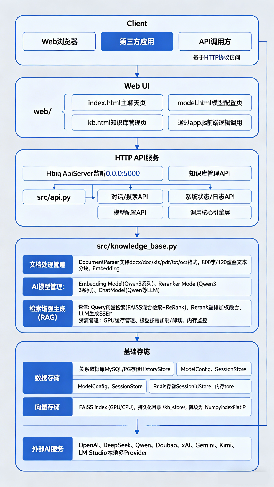
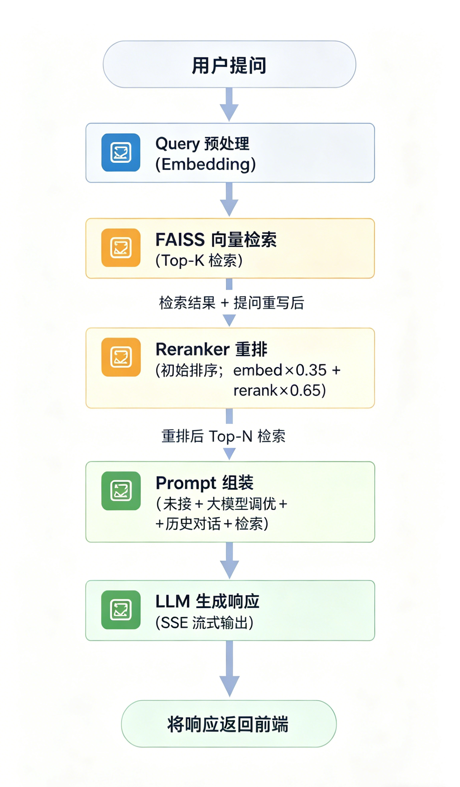

<p align="center">
  
</p>

<p align="center">
  <a href="https://framewiki.com/">https://framewiki.com/</a>
</p>

<p align="center">
  <a href="README.md">简体中文</a> |
  <a href="README-EN.md">English</a>
</p>

<p align="center">
  
  
  
  
</p>

# WIKI 本地知识库

WIKI 本地知识库是一个本地优先、可私有化部署的开源知识库服务，提供向量检索、重排、对话式问答、模型管理和 Web 控制台能力，适合构建企业内部知识问答、团队文档助手、个人知识中枢等场景。

本项目是一个本地优先的开源知识库服务，融合向量检索、重排与对话式问答能力，内置轻量 HTTP API 与 Web 控制台，支持 SSE 流式响应，适合构建私有化知识问答应用。

## 文档导航

- [项目亮点](#项目亮点)
- [适用场景](#适用场景)
- [功能对比](#功能对比)
- [系统架构](#系统架构)
- [项目结构](#项目结构)
- [快速开始](#快速开始)
- [Web 控制台](#web-控制台)
- [API 文档](#api-文档)
- [配置说明](#配置说明)
- [模型与部署建议](#模型与部署建议)
- [运维与脚本](#运维与脚本)
- [数据与安全](#数据与安全)
- [贡献与许可](#贡献与许可)

## 项目亮点

- 本地优先部署，知识库、向量索引和会话数据可完全留在私有环境内。
- 内置检索 + 重排链路，提升召回质量和答案相关性。
- 支持 SSE 流式响应，适合聊天问答与前端逐字输出。
- 支持 `user_id` 与 `session_id` 上下文会话管理。
- 支持文本新增、文件上传、批量导入、目录重建等知识导入方式。
- 支持分片查看、编辑、删除、重建，便于精细化维护知识内容。
- 内置模型配置管理，兼容 OpenAI、DeepSeek、Qwen、Doubao、xAI、Gemini、Kimi、LM Studio 等多种提供商。
- 同时支持内存、数据库、Redis 等不同存储后端，适合从单机到多实例部署。

## 适用场景

- 企业内部知识问答平台
- 团队规范、制度、SOP 检索助手
- 个人学习资料、技术笔记、本地文档中枢
- 私有化 AI 问答系统原型验证
- 需要离线或局域网部署的知识应用

## 功能对比

| 功能模块 | 开源社区版 | 商业授权版（规划/已实现） |
| --- | --- | --- |
| 本地知识库存储 | ✅ | ✅ |
| 向量检索（FAISS / zvec） | ✅ | ✅ |
| 文档导入/批量上传 | ✅ | ✅ |
| 文档识别 | 仅文字识别 | 支持图片 / 扫描 PDF 等 OCR |
| 文档分片 | 固定长度分片 | 语义递归分片 |
| 重排（Rerank） | ✅ | ✅ |
| 多模型支持 | ✅ | ✅ |
| SSE 流式响应 | ✅ | ✅ |
| Web UI | ✅ | ✅ |
| API 接口 | ✅ | ✅ |
| 用户/会话上下文 | ✅ | ✅ |
| Redis 高并发支持 | ✅ | ✅ |
| 权限与多用户 | - | ✅ |
| MCP 能力（模型上下文协议） | - | ✅ |
| 插件/扩展机制 | - | ✅ |
| 企业级安全能力 | - | ✅ |
| 商业技术支持 | - | ✅ |
| SLA 服务保障 | - | ✅ |
| 专属定制开发 | - | ✅ |

## 系统架构

```text
Client / Browser (frontend/ Vue 控制台)
         |
         v
HTTP API (src/api/ · 业务路径前缀 /api)
         |
         +-- Web UI (frontend/dist，由后端托管)
         +-- Session / History Store (src/store/)
         |     +-- memory
         |     +-- db
         |     +-- redis
         |
         +-- Knowledge Base (src/knowledge_base.py)
                                 +-- document parsers
                                 +-- chunking
                                 +-- embeddings
                                 +-- vector index (FAISS / zvec / numpy)
                                 +-- reranker
                                 +-- chat model / LLM client
```

**系统整体架构图**


核心执行流程：

1. 文档导入后会被切分为 chunk，并写入本地知识库存储目录。
2. Chunk 经过 Embedding 向量化后进入向量索引（FAISS / zvec 等）。
3. 用户提问时先做向量召回，再做 Rerank 重排。
4. 最终上下文与历史会话拼装后交给聊天模型生成答案。
5. Web UI 与 API 都通过统一的 HTTP 服务对外提供能力。

**核心数据流图（RAG 检索问答流程）**


## 项目结构

```text
.
├─ src/
│  ├─ api/                       # HTTP API（http_server + handlers，前缀 /api）
│  ├─ main.py                    # 启动入口
│  ├─ knowledge_base.py          # 知识库核心逻辑
│  ├─ document_parsers/          # 按类型拆分的文档解析
│  ├─ universal_llm_client.py    # 多模型统一客户端
│  ├─ model_config_manager.py    # 模型配置管理
│  ├─ windows_service.py         # Windows 服务入口
│  └─ store/                     # 会话/历史存储实现
├─ frontend/                     # Vue3 Web 控制台（构建产物 frontend/dist）
├─ conf/                         # 运行配置（优先 conf/config.json）
├─ assets/                       # README 截图与静态资源
├─ config.json                   # 兼容保留的主配置文件
├─ config.multi-provider.example.json
├─ manage_service.ps1            # Windows 服务管理脚本
├─ manage_service.sh             # Linux systemd 服务管理脚本
├─ encrypt_secret.py             # 密钥加密工具
├─ ingest_to_kb_store.py         # 知识导入工具
├─ migrate_to_sessions_table.py  # 历史数据迁移脚本
└─ tune_threshold.py             # 检索阈值调优脚本
```

## 快速开始

### 运行要求

- Python 3.10 及以上
- Node.js（构建 Web 控制台时需要，建议 18+）
- 推荐使用虚拟环境 `venv`
- 如需 GPU 推理，请准备对应 CUDA 环境
- 如需 Redis / MySQL / PostgreSQL，请提前安装并配置

### 1. 安装依赖

```bash
pip install -r requirements.txt
```

如需打包构建：

```bash
pip install -r requirements.build.txt
```
### 2. 配置服务

编辑 `conf/config.json`（优先）或根目录 `config.json`（兼容），重点关注以下配置：

- `server`：HTTP 服务监听地址与端口
- `db`：历史记录存储后端与数据库连接
- `session`：会话后端，可选 `memory` 或 `redis`
- `knowledge_base.storage`：知识库数据目录、模型缓存目录与向量后端（`faiss` / `zvec` / `numpy`）
- `knowledge_base.embedding`：Embedding 模型配置
- `knowledge_base.rerank`：Rerank 模型配置
- `knowledge_base.chat`：对话模型配置
- `knowledge_base.lm_studio`：兼容 OpenAI 风格接口的模型服务地址
- `chat_context`：上下文轮数与开关

多提供商配置示例可参考 `config.multi-provider.example.json`。

### 3. 构建 Web 控制台并启动服务

```bash
cd frontend
npm install
npm run build
cd ..
python -m src.main
```

如果已通过包方式安装，也可以使用：

```bash
knowledge-base
```

默认监听地址取自配置中的 `server.host` 和 `server.port`，默认端口为 `5000`。

### 4. 常用启动参数

```bash
python -m src.main --host 127.0.0.1 --port 5000
```

可用参数：

- `--host`：指定监听地址
- `--port`：指定监听端口
- `--no-preload-embedding`：启动时不预热 Embedding 模型
- `--no-preload-reranker`：启动时不预热 Reranker 模型

### 5. 环境变量

- `KB_CONFIG_PATH`：指定自定义配置文件路径
- `KB_PRELOAD_EMBEDDING`：是否在启动时预热 Embedding 模型
- `KB_PRELOAD_RERANKER`：是否在启动时预热 Reranker 模型
- `KB_WARMUP_STRICT`：模型预热失败时是否中止启动

## Web 控制台

启动后可访问：

- `http://127.0.0.1:5000/`：Web 控制台首页
- `http://127.0.0.1:5000/retrieval-qa`：聊天 / 检索问答
- `http://127.0.0.1:5000/kb/management`：知识库管理
- `http://127.0.0.1:5000/model/management`：模型管理

功能概览：

- 聊天：新建会话、历史记录、SSE 流式回答、深度思考开关（默认关闭）、复制回答、来源查看
- 知识库管理：新增文本、上传文件、批量上传、文档筛选、分片编辑/删除/重建、检索参数设置、统计信息
- 模型管理：新增/编辑模型配置、启用/停用、设置默认、连通性测试、初始化预设配置

**聊天**


**知识库管理**


**分片管理**


**模型管理**


## API 文档

- 控制台入口：顶栏「登录」右侧的 **API 文档**（路由 `/api-docs`，Vue 页面）
- 业务接口统一前缀：`/api`（如 `/api/query`）

**API 文档**


## 配置说明

### 核心配置字段

`conf/config.json`（或兼容的根目录 `config.json`）常用字段：

- `search.default_k`：默认召回数量
- `search.max_search_results`：最大返回来源数量
- `search.min_source_similarity`：最小来源相似度阈值
- `db.backend`：历史记录后端，支持 `memory`、`mysql`、`postgresql`
- `session.backend`：会话后端，支持 `memory`、`redis`
- `knowledge_base.storage.vector_backend`：向量后端，支持 `faiss`、`zvec`、`numpy`
- `knowledge_base.chunking.size`：分片长度
- `knowledge_base.chunking.overlap`：分片重叠长度
- `knowledge_base.retrieval.candidate_multiplier`：候选召回倍数
- `knowledge_base.retrieval.min_candidates`：最小候选数
- `knowledge_base.retrieval.embed_weight`：向量召回权重
- `knowledge_base.retrieval.rerank_weight`：重排权重

### 多模型接入

通过 `UniversalLLMClient` 支持主流模型服务：

| 提供商 | 示例模型 | `base_url` 示例 |
| --- | --- | --- |
| OpenAI | GPT-4, GPT-3.5-Turbo | `https://api.openai.com/v1` |
| DeepSeek | deepseek-chat, deepseek-coder | `https://api.deepseek.com/v1` |
| Qwen | qwen-max, qwen-plus | `https://dashscope.aliyuncs.com/compatible-mode/v1` |
| Doubao | doubao-pro-32k | `https://ark.cn-beijing.volces.com/api/v3` |
| xAI | grok-beta | `https://api.x.ai/v1` |
| Gemini | gemini-pro | `https://generativelanguage.googleapis.com/v1beta` |
| Kimi | moonshot-v1-32k | `https://api.moonshot.cn/v1` |
| LM Studio | 本地模型 | `http://localhost:1234/v1` |

建议优先使用 `config.multi-provider.example.json` 作为多模型接入参考模板。

`UniversalLLMClient` 当前基于 OpenAI Python SDK 实现，对 OpenAI 兼容接口统一封装了聊天、流式输出、向量嵌入与重排序能力。

### 支持的文档格式

| 格式 | 开源社区版 | 商业授权版 | 说明 |
| --- | --- | --- | --- |
| docx | ✅ | ✅ | 文本解析 |
| doc | - | ✅ | 商业授权支持 |
| xls | ✅ | ✅ | 文本解析 |
| xlsx | ✅ | ✅ | 文本解析 |
| txt | ✅ | ✅ | 文本解析 |
| log | ✅ | ✅ | 文本解析 |
| 图片 | - | ✅ | 商业授权支持 OCR |
| PDF | 仅纯文本 | ✅ | 商业授权支持 OCR |
| OFD | 仅纯文本 | ✅ | 商业授权支持 OCR |

### Session ID 唯一性

当 `session.backend=redis` 时，会话 ID 由 Redis 原子自增生成，可保证同一用户在高并发与多实例部署下不重复。若 Redis 不可用，会回退为内存生成，仅保证进程内唯一。

## 模型与部署建议

### 可选解析与 OCR

社区版以文字识别为主。图片 OCR、扫描件识别等能力属于**商业授权版**，请访问官网了解：[https://framewiki.com/](https://framewiki.com/)。

配置示例文件：[config.multi-provider.example.json](config.multi-provider.example.json)

### OCR 配置

> 以下 OCR 配置仅适用于**商业授权版**。社区版即使写入相关配置也不会启用 OCR。

OCR 支持 `llm` 与 `paddleocr` 两种引擎，通过 `knowledge_base.ocr.engine` 切换。

`llm` 相关的视觉模型参数统一放在 `knowledge_base.ocr.llm` 下，`ocr` 顶层只保留通用开关。

```json
{
  "knowledge_base": {
    "ocr": {
      "enabled": true,
      "engine": "llm",
      "local_files_only": true,
      "release_after_use": true,
      "pdf_ocr_dpi": 200,
      "pdf_ocr_max_pages": 0,
      "llm": {
        "model_name": "Qwen/Qwen2-VL-2B-Instruct",
        "prompt": "请识别图片中的所有内容，并以 markdown 结构化文档返回。",
        "device": "cpu",
        "dtype": "auto",
        "max_new_tokens": 1024,
        "min_pixels": 0,
        "max_pixels": 0
      },
      "paddleocr": {
        "lang": "ch",
        "use_textline_orientation": true,
        "use_angle_cls": true,
        "show_log": false
      }
    }
  }
}
```

补充说明：

- `engine=llm` 适合复杂版面、图文混排和结构化 Markdown 输出。
- `engine=paddleocr` 适合普通文本 OCR，资源占用更低。
- 若要求严格本地加载，请保持 `local_files_only=true`。
- 可选依赖安装与排错说明见 [docs/OPTIONAL_PARSER_SETUP.md](docs/OPTIONAL_PARSER_SETUP.md)。

### Embedding/Reranker 推荐配置

下表为 0.6B / 4B / 8B 模型的推荐部署配置，便于选择合适硬件与参数：

| 规模 | CPU | 内存 | GPU | 适用场景 | 备注 |
| --- | --- | --- | --- | --- | --- |
| 0.6B | 8 核 | 16GB | 可选（>= 6GB） | 开发、测试、中小数据量 | 本地默认规模 |
| 4B | 16 核 | 32GB | 建议 >= 12GB | 生产单机、中等并发 | 建议开启 GPU |
| 8B | 24 核 | 64GB | 建议 >= 24GB | 高质量检索、高并发 | GPU 必开 |

部署建议：

- 模型规模越大，GPU 越关键；显存不足时会回退 CPU，响应明显变慢。
- 模型缓存和向量索引建议放在 SSD，降低加载与检索延迟。
- 多实例部署建议将 `session.backend` 配置为 `redis`。
- 首次部署建议先关闭大模型预热，确认服务链路可用后再逐步开启。

### 轻量配置示例

```json
{
  "knowledge_base": {
    "storage": {
      "vector_backend": "zvec",
      "persist_dir": "./kb_store"
    },
    "embedding": {
      "model": "Qwen/Qwen3-Embedding-0.6B",
      "device": "auto",
      "local_files_only": true
    },
    "rerank": {
      "model": "Qwen/Qwen3-Reranker-0.6B",
      "use_lm_studio": false
    },
    "retrieval": {
      "candidate_multiplier": 8,
      "min_candidates": 30,
      "embed_weight": 0.35,
      "rerank_weight": 0.65
    }
  }
}
```

## 运维与脚本

### 常用脚本

| 脚本 | 用途 |
| --- | --- |
| `download_models.py` | 下载基础模型 |
| `download_optional_parser_models.py` | 下载可选文档解析 / OCR 模型 |
| `ingest_to_kb_store.py` | 导入文档到知识库存储 |
| `encrypt_secret.py` | 加密配置中的敏感字段 |
| `migrate_to_sessions_table.py` | 迁移会话数据结构 |
| `add_thinking_summary_column.py` | 为数据表补充思考摘要列 |
| `tune_threshold.py` | 调整检索阈值 |

### Windows 服务

通过 `manage_service.ps1` 管理 Windows 服务：

```powershell
.\manage_service.ps1 -Command install
.\manage_service.ps1 -Command start
.\manage_service.ps1 -Command status
```

支持命令：`install`、`uninstall`、`start`、`stop`、`restart`、`status`。

### Linux systemd 服务

通过 `manage_service.sh` 管理 Linux 服务：

```bash
./manage_service.sh install
./manage_service.sh start
./manage_service.sh status
```

### 构建与分发

使用 Python 标准构建方式：

```bash
python -m build
```

也可以使用仓库内脚本：

- Windows PowerShell：`build.ps1`
- Windows CMD：`build.bat`
- Wheel 构建：`build_wheel.ps1`、`build_wheel.bat`

构建产物位于 `dist/`。

## 数据与安全

### 数据目录

- 默认知识库目录：`kb_store/`
- 模型缓存目录：`models/hf_cache/`
- 日志目录：运行时自动创建于项目目录下

### 安全建议

- 建议仅在可信网络内开放 API。
- 生产环境请使用反向代理、访问控制和 HTTPS。
- 配置文件中的 API Key、数据库密码建议使用 `encrypt_secret.py` 处理。
- 若启用多实例部署，请将 Redis 和数据库放置在受控网络内。

## 贡献与许可

### 贡献

欢迎提交 Issue 与 PR。功能变更时请同步更新文档与配置说明。

### License

MulanPSL-2.0
