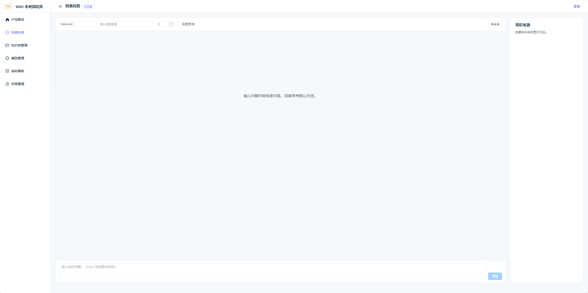
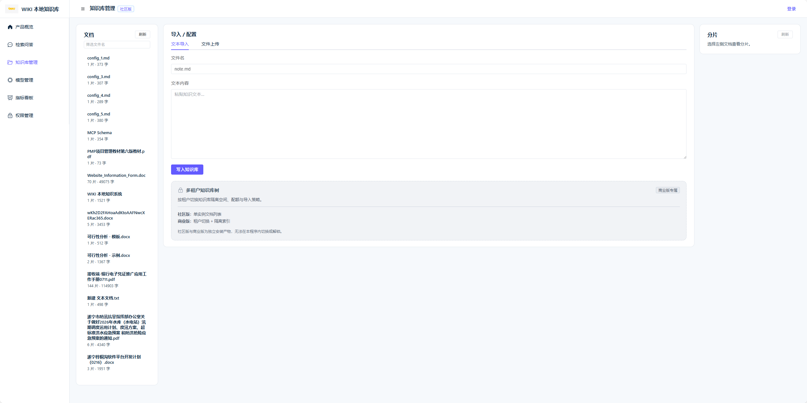
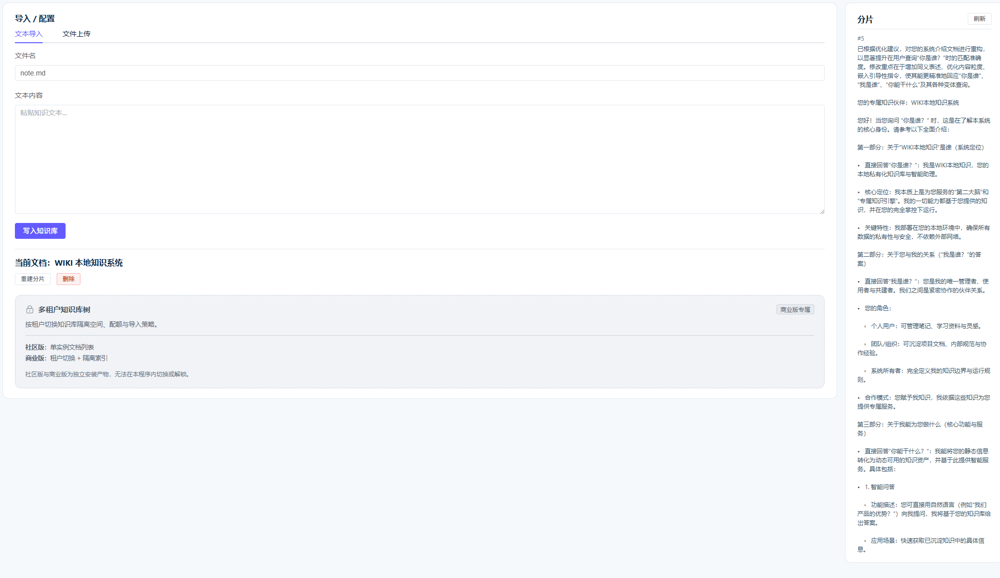
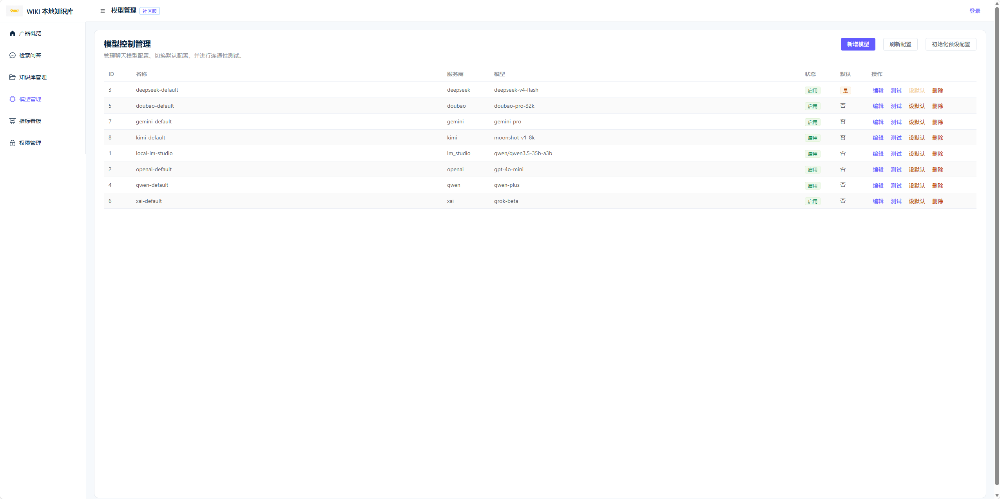
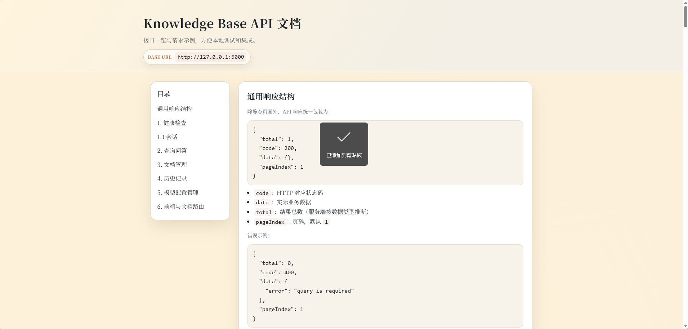

<div align="center">
 
 <p><a href="https://framewiki.com/">https://framewiki.com/</a></p>
 <p>
  
  
  
  
 </p>
</div>

# WIKI 本地知识库

本项目是一个本地优先的开源知识库服务，融合向量检索、重排与对话式问答能力，内置轻量 HTTP API 与 Web 控制台，支持 SSE 流式响应，适合构建私有化知识问答应用。

## 亮点

- 本地私有化存储，向量索引与分片持久化。
- 检索 + 重排流程提升回答相关性。
- SSE 流式响应，适配聊天场景。
- 支持 `user_id` 与 `session_id` 的上下文会话。
- 文档导入（单文档、批量上传、目录重建）。
- 分片管理（查看、编辑、删除、重建）。
- 多模型支持，兼容 OpenAI、DeepSeek、Qwen、Doubao、xAI、Gemini、Kimi、LM Studio 等。

## 功能点对比表

| 功能模块 | 开源社区版 | 商业授权版（规划/已实现） |
| --- | --- | --- |
| 本地知识库存储 | ✅ | ✅ |
| FAISS 向量检索 | ✅ | ✅ |
| 文档导入/批量上传 | ✅ | ✅ |
| 文档识别 | 仅文字识别 | 支持 DOC 文档与图片/PDF/OFD 的 OCR（paddleOCR 或 Qwen/Qwen2-VL-2B-Instruct） |
| 文档分片 | 固定长度分片 | 语义分片（按内容语义自动切分） |
| 重排（Rerank） | ✅ | ✅ |
| 多模型支持 | ✅ | ✅ |
| SSE 流式响应 | ✅ | ✅ |
| Web UI | ✅ | ✅ |
| API 接口 | ✅ | ✅ |
| 用户/会话上下文 | ✅ | ✅ |
| Redis 高并发支持 | ✅ | ✅ |
| 权限与多用户 | - | ✅（企业/团队多用户与权限管理） |
| 文档语义分片 | - | ✅（按语义自动切分，提升检索效果） |
| MCP 能力（模型上下文协议） | - | ✅（支持多模型/多后端统一调度） |
| 插件/扩展机制 | - | ✅（支持自定义插件与扩展） |
| 企业级安全 | - | ✅（更细粒度权限、审计、加密等） |
| 商业技术支持 | - | ✅ |
| SLA 服务保障 | - | ✅ |
| 专属定制开发 | - | ✅ |

## 架构

```
client (web/app.js)
 |
 v
HTTP API (src/api.py)
 |
 +-- store (src/store)
 |     +-- db (history, session)
 |     +-- redis (session)
 |
 +-- knowledge base (src/knowledge_base.py)
        +-- embeddings
        +-- FAISS index
        +-- reranker
        +-- LLM chat
```

## 快速开始

### 1) 安装依赖

```bash
pip install -r requirements.txt
```

### 2) 配置

按需修改 `config.json`（数据库、Redis、模型与上下文配置等）。

### 3) 启动服务

```bash
python -m src.main
```

默认监听：`http://127.0.0.1:5000`

## Web 控制台

访问 `http://127.0.0.1:5000/ui/` 使用内置 Web UI。

功能概览（来自 `web/`）：

- 聊天页面：新建会话、历史记录、SSE 流式回答、深度思考开关、复制回答、来源查看。

**聊天**


- 知识库管理：新增文本、上传文件、批量上传、文档列表筛选、分片管理（编辑/删除/重建）、检索参数设置、统计信息。

## 支持的文档格式

| 格式 | 开源社区版 | 商业授权版 | 说明 |
| --- | --- | --- | --- |
| docx | ✅ | ✅ | 文本解析 |
| doc | - | ✅ | 商业授权支持 |
| xls | ✅ | ✅ | 文本解析 |
| xlsx | ✅ | ✅ | 文本解析 |
| txt | ✅ | ✅ | 文本解析 |
| log | ✅ | ✅ | 文本解析 |
| 图片 | - | ✅ | 商业授权支持 OCR |
| PDF | 仅纯文本 | ✅ | 商业授权支持 OCR |
| OFD | 仅纯文本 | ✅ | 商业授权支持 OCR |

**知识库管理**


**分片管理**


- 模型管理：新增/编辑模型配置、启用/停用、设置默认、连通性测试、初始化预设配置。
- 
**模型管理**


页面入口：

- `GET /ui/` 聊天页面
- `GET /ui/kb.html` 知识库管理
- `GET /ui/model.html` 模型管理

## API 文档

- 在线文档：`http://127.0.0.1:5000/api-docs` 或 `http://127.0.0.1:5000/docs/`
- 仓库内接口说明：`docs/API.md`
- 英文接口说明：`docs/API-EN.md`

**API 文档**


## 配置说明

`config.json` 常用字段：

- `knowledge_base`：Embedding/Rerank 模型与检索配置。
- `db`：历史记录存储后端（`memory` / `mysql` / `postgresql`）。
- `session`：会话 ID 存储后端（`memory` / `redis`）。
- `chat_context`：上下文开关与最大轮数。
- `lm_studio`：LM Studio 连接与超时配置。

## 支持的 AI 模型

通过 `UniversalLLMClient` 支持主流模型服务：

| 提供商 | 示例模型 | 配置示例 |
| --- | --- | --- |
| OpenAI | GPT-4, GPT-3.5-Turbo | `base_url: https://api.openai.com/v1` |
| DeepSeek | deepseek-chat, deepseek-coder | `base_url: https://api.deepseek.com/v1` |
| Qwen | qwen-max, qwen-plus | `base_url: https://dashscope.aliyuncs.com/compatible-mode/v1` |
| Doubao | doubao-pro-32k | `base_url: https://ark.cn-beijing.volces.com/api/v3` |
| xAI | grok-beta | `base_url: https://api.x.ai/v1` |
| Gemini | gemini-pro | `base_url: https://generativelanguage.googleapis.com/v1beta` |
| Kimi | moonshot-v1-32k | `base_url: https://api.moonshot.cn/v1` |
| LM Studio | 本地模型 | `base_url: http://localhost:1234/v1` |

示例见 `config.multi-provider.example.json`。

## 可选解析与 OCR

如需 OCR 或 PDF Marker 能力，请安装 `requirements.optional-parser.txt`。

配置示例文件：[config.multi-provider.example.json](config.multi-provider.example.json)

## Embedding/Reranker 推荐配置

下表为 0.6B / 4B / 8B 模型的推荐部署配置，便于选择合适硬件与参数：

| 规模 | CPU | 内存 | GPU | 适用场景 | 备注 |
| --- | --- | --- | --- | --- | --- |
| 0.6B | 8 核 | 16GB | 可选（>= 6GB） | 开发/测试、中小数据 | 本地默认规模 |
| 4B | 16 核 | 32GB | 建议 >= 12GB | 生产单机、中等并发 | 建议开启 GPU |
| 8B | 24 核 | 64GB | 建议 >= 24GB | 高质量检索/高并发 | GPU 必开 |

配置建议：

- 规模越大，GPU 越关键；显存不足时会回退 CPU，响应显著变慢。
- 模型缓存与向量索引建议放 SSD，降低加载和检索延迟。
- 多实例部署时配合 Redis 作为 session 后端。

### config.json 示例

0.6B（轻量默认）：

```json
{
 "knowledge_base": {
  "embedding": {
   "model": "Qwen/Qwen3-Embedding-0.6B",
   "device": "auto",
   "local_files_only": true
  },
  "rerank": {
   "model": "Qwen/Qwen3-Reranker-0.6B",
   "use_lm_studio": false
  },
  "retrieval": {
   "candidate_multiplier": 8,
   "min_candidates": 30,
   "embed_weight": 0.35,
   "rerank_weight": 0.65
  }
 }
}
```

4B（中等规模）：

```json
{
 "knowledge_base": {
  "embedding": {
   "model": "Qwen/Qwen3-Embedding-4B",
   "device": "cuda",
   "local_files_only": true
  },
  "rerank": {
   "model": "Qwen/Qwen3-Reranker-4B",
   "use_lm_studio": false
  },
  "retrieval": {
   "candidate_multiplier": 6,
   "min_candidates": 24,
   "embed_weight": 0.4,
   "rerank_weight": 0.6
  }
 }
}
```

8B（高质量/高并发）：

```json
{
 "knowledge_base": {
  "embedding": {
   "model": "Qwen/Qwen3-Embedding-8B",
   "device": "cuda",
   "local_files_only": true
  },
  "rerank": {
   "model": "Qwen/Qwen3-Reranker-8B",
   "use_lm_studio": false
  },
  "retrieval": {
   "candidate_multiplier": 5,
   "min_candidates": 20,
   "embed_weight": 0.45,
   "rerank_weight": 0.55
  }
 }
}
```

## Session ID 唯一性

当 `session.backend=redis` 时，会话 ID 由 Redis 原子自增生成，可保证同一用户在高并发与多实例部署下不重复。若 Redis 不可用，会回退为内存生成（仅保证进程内唯一）。

## 数据与存储

- 默认数据目录：`kb_store/`
- 文档会被切分、向量化并存入 FAISS
- 元信息以 JSON 形式保存用于检索

## 安全说明

- 建议仅在可信网络内开放 API。
- 使用 `encrypt_secret.py` 加密 `config.json` 中的密钥。

## 工具脚本

- `encrypt_secret.py`：加密配置密钥
- `tune_threshold.py`：阈值评估

## 构建与发布

```bash
python -m build
```

产物位于 `dist/`。

## 贡献

欢迎提交 Issue 与 PR。功能变更请同步更新文档。

## 许可

MulanPSL2
